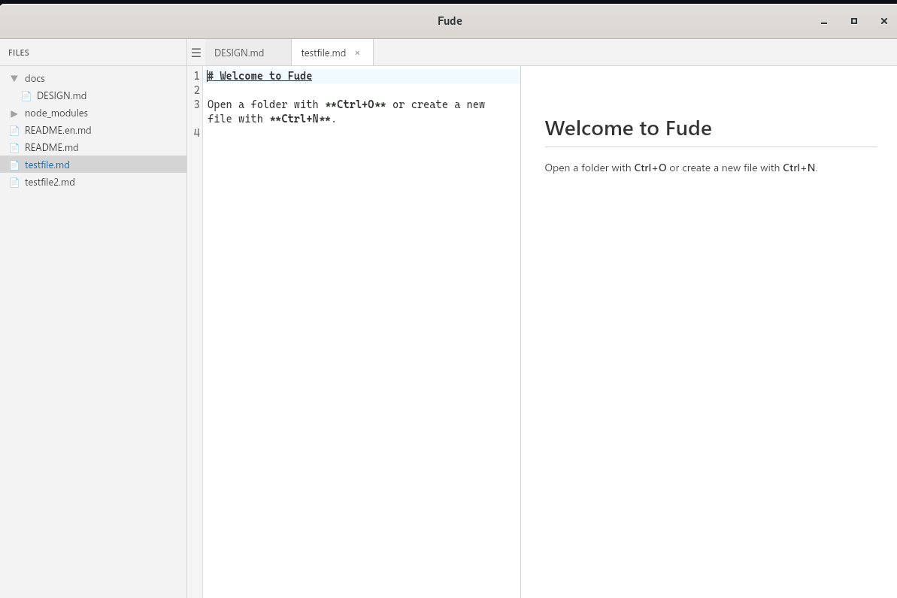

# Fude (筆)

An ultra-lightweight cross-platform Markdown editor

[](https://github.com/dobachi/fude/releases)
[](LICENSE)
[](https://github.com/dobachi/fude/actions)



[日本語版 README](README.md)

## Features

- **Ultra-lightweight** - ~3MB binary. No Electron, powered by Tauri v2 for instant startup
- **Cross-platform** - Windows, macOS, Linux, and WSL
- **Vim mode** - `jj` / `jk` to exit insert mode (ESC alternative for browser compatibility)
- **Real-time Markdown preview** - Side-by-side editor and preview
- **Pane splitting** - VS Code-style vertical/horizontal splits with real-time sync
- **Tabs + session restore** - Automatically restores your previous workspace
- **Dark/Light themes** - VS Code-inspired color scheme
- **Auto-save + crash recovery** - Edits are backed up automatically; recoverable after crashes
- **Obsidian Vault support** - Open any directory to browse `.md` files in a tree view
- **AI Copilot** - AI-powered editing via OpenRouter (planned)
- **Auto-update** - Built-in updater via Tauri Updater
- **WSL browser mode** - Browser-based UI with full Japanese IME support
- **WSL remote mode** - Automatically downloads and launches Windows version from WSL
- **No framework** - Built with Vanilla JS for speed and simplicity

## Installation

### Windows

Download the latest release from [GitHub Releases](https://github.com/dobachi/fude/releases):

- **exe**: `Fude_x.x.x_x64-setup.exe` (NSIS installer)
- **msi**: `Fude_x.x.x_x64.msi` (MSI installer)

### macOS

Download the `.dmg` file from [GitHub Releases](https://github.com/dobachi/fude/releases).

### Linux (deb)

```bash
# Download from GitHub Releases
sudo dpkg -i Fude_x.x.x_amd64.deb
```

### Linux (AppImage)

```bash
chmod +x Fude_x.x.x_amd64.AppImage
./Fude_x.x.x_amd64.AppImage
```

### WSL

After installing the deb package, three launch modes are available:

```bash
fude             # Native GUI (WSLg)
fude-browser     # Browser mode (http://localhost:3000) - full IME support
fude-remote      # Auto-downloads and launches Windows version
```

## Usage

### Basic workflow

1. **Launch** - Start the app to see the welcome tab
2. **Open a folder** - `Ctrl+O` to select a directory containing Markdown files
3. **Edit** - Click a file in the sidebar to open it in the editor
4. **Preview** - `Ctrl+K` to toggle split view with real-time preview
5. **Save** - `Ctrl+S` to save (auto-deletes temp backup)

### CLI arguments

```bash
fude /path/to/vault    # Open a directory
fude /path/to/file.md  # Open a specific file
```

### View modes

| Mode | Description | Shortcut |
|------|-------------|----------|
| Editor only | Show only the editor | `Ctrl+J` |
| Split view | Editor + preview side by side | `Ctrl+K` |
| Preview only | Show only the preview | `Ctrl+L` |

### Settings

Press `Ctrl+,` to open settings:

- Theme (Dark / Light)
- Font size
- Key mode (Normal / Vim)
- Feature toggles (AI Copilot, Diff Highlight)
- OpenRouter API key

Settings are stored in `~/.config/fude/config.json`.

## Keyboard shortcuts

### Global shortcuts

| Key | Action |
|-----|--------|
| `Ctrl+J` | Editor only view |
| `Ctrl+K` | Split view |
| `Ctrl+L` | Preview only view |
| `Ctrl+T` | New tab |
| `Ctrl+N` | New file |
| `Ctrl+W` | Close tab |
| `Ctrl+Tab` | Next tab |
| `Ctrl+Shift+Tab` | Previous tab |
| `Ctrl+S` | Save |
| `Ctrl+Shift+S` | Save As |
| `Ctrl+O` | Open folder |
| `Ctrl+B` | Bold toggle (`**`) |
| `Ctrl+E` | Toggle sidebar |
| `Ctrl+F` | Search & replace |
| `Ctrl+\|` / `Ctrl+Shift+D` | Split vertically |
| `Ctrl+\` / `Ctrl+Shift+H` | Split horizontally |
| `Ctrl+Shift+W` | Close split pane |
| `Ctrl+Arrow` | Move between panes |
| `Ctrl+-` | Decrease font size |
| `Ctrl++` | Increase font size |
| `Ctrl+Scroll` | Zoom in/out |
| `Ctrl+Shift+M` | Toggle Vim mode |
| `jj` / `jk` | Exit Vim insert mode (ESC alternative) |
| `Ctrl+,` | Settings |
| `Ctrl+?` | Help |

### Preview pane Vim navigation

Available when the preview pane is focused:

| Key | Action |
|-----|--------|
| `j` | Scroll down (60px) |
| `k` | Scroll up (60px) |
| `d` | Half page down |
| `u` | Half page up |
| `Space` / `PageDown` | Page down |
| `PageUp` | Page up |
| `gg` | Scroll to top |
| `G` | Scroll to bottom |

## Building from source

### Prerequisites

- **Node.js** 22+
- **Rust** (stable)
- **Linux additional packages**:
  ```bash
  sudo apt install libwebkit2gtk-4.1-dev libayatana-appindicator3-dev
  ```

### Build commands

```bash
git clone https://github.com/dobachi/fude.git
cd fude
make setup       # Install all dependencies
make dev         # Development mode (Tauri dev)
make build       # Production build
make browser     # Browser mode (for WSL)
make test        # Run all tests (JS + Rust)
make lint        # Run all linters (ESLint + Clippy)
make format      # Format all code (Prettier + cargo fmt)
make check       # lint + format + test + build (CI)
make remote      # Launch Windows Fude from WSL
make clean       # Clean build artifacts
```

## Tech stack

| Category | Technology |
|----------|-----------|
| Framework | [Tauri v2](https://tauri.app/) (Rust) |
| Editor | [CodeMirror 6](https://codemirror.net/) |
| Vim keybindings | [@replit/codemirror-vim](https://github.com/replit/codemirror-vim) |
| Markdown parser | [markdown-it](https://github.com/markdown-it/markdown-it) |
| Frontend | Vanilla JS (no framework) |
| Bundler | [esbuild](https://esbuild.github.io/) |
| Tests (JS) | [Vitest](https://vitest.dev/) + jsdom |
| Tests (Rust) | cargo test |
| Lint | ESLint + Clippy |
| Formatter | Prettier + cargo fmt |

## Roadmap

- **Diff highlighting** - Show changed lines in the editor gutter (git integration)
- **AI Copilot** - Chat, Composer, and inline completion via OpenRouter
- **Emacs keybindings** - Extension point ready in keymode.js
- **Obsidian wikilinks** - `[[link]]` syntax for file navigation
- **Plugin system** - Load external plugins

## License

MIT License

## Contributing

Bug reports and feature requests are welcome via [Issues](https://github.com/dobachi/fude/issues).

Pull requests are also welcome. For major changes, please open an issue first to discuss the approach.

### Development workflow

1. Fork the repository
2. Create a feature branch (`git checkout -b feature/my-feature`)
3. Commit your changes (`git commit -m 'Add: ...'`)
4. Push the branch (`git push origin feature/my-feature`)
5. Open a pull request
