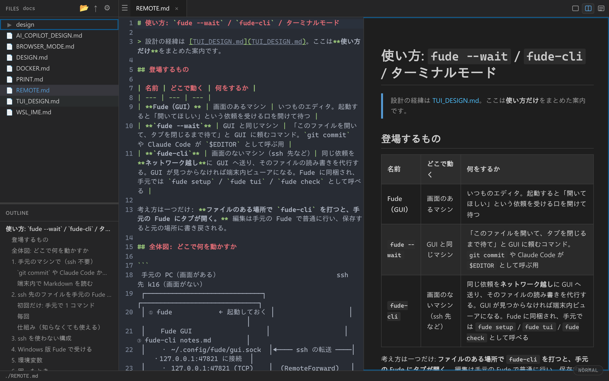

# Fude (筆)

超軽量クロスプラットフォーム Markdown エディタ

[](https://github.com/dobachi/fude/releases)
[](LICENSE)
[](https://github.com/dobachi/fude/actions)



[English README](README.en.md)

## 特徴

- **超軽量** - バイナリサイズ約3MB。Electron不使用、Tauri v2で高速起動
- **クロスプラットフォーム** - Windows, macOS, Linux, WSL対応
- **Vimモード** - `jj` / `jk` でインサートモード解除 (ESC代替)
- **リアルタイムMarkdownプレビュー** - エディタとプレビューの分割表示
- **ペイン分割** - VS Code風の縦・横分割
- **タブ管理 + セッション復元** - 前回の作業状態を自動復元
- **ダーク/ライトテーマ** - VS Code風の配色
- **暫定ファイル自動保存 + クラッシュ復元** - 編集内容を自動バックアップ、クラッシュ時に復旧
- **Obsidian Vault対応** - ディレクトリを開くだけで`.md`ファイルをツリー表示
- **AIコパイロット** - OpenRouter経由のAIチャット、Composer、インライン補完
  - チャット出力のMarkdownレンダリング（コードブロック、リスト等）
  - メッセージコピーボタン、ドキュメントコンテキスト自動連携
  - 右クリックからAI書き換え・要約・展開・文法修正
  - パネル幅のドラッグリサイズ
- **自動アップデート** - Tauri Updaterによるアプリ更新
- **WSLブラウザモード** - 日本語IME対応のブラウザベースUI (`http://localhost:3000`)
- **WSLリモートモード** - Windows版Fudeを自動取得して起動
- **フレームワーク不使用** - Vanilla JSで実装、高速かつ軽量

## インストール

### Windows

GitHub Releasesから最新版をダウンロードしてください。

- **exe**: `Fude_x.x.x_x64-setup.exe` (NSISインストーラー)
- **msi**: `Fude_x.x.x_x64.msi` (MSIインストーラー)

### macOS

GitHub Releasesから`.dmg`ファイルをダウンロードしてインストールしてください。

### Linux (deb)

```bash
# GitHub Releasesからダウンロード
sudo dpkg -i Fude_x.x.x_amd64.deb
```

### Linux (AppImage)

```bash
chmod +x Fude_x.x.x_amd64.AppImage
./Fude_x.x.x_amd64.AppImage
```

### WSL

debパッケージでインストール後、3つの起動モードが利用できます。

```bash
fude             # ネイティブGUI (WSLg)
fude-browser     # ブラウザモード (http://localhost:3000) - 日本語IME対応（`fude browser` でも同じ）
fude-remote      # Windows版を自動取得して起動
```

> **ブラウザモードは起動時に表示される `?token=...` 付きの URL で開いてください。**
> この HTTP API は Tauri 版と同じ権限でファイルを読み書きするため、
> 既定でループバック (`127.0.0.1`) のみにバインドし、全 API にトークンを要求します。

スマートフォンなど別端末から開きたい場合は、**接続を許す範囲**と**鍵**と
**公開するディレクトリ**を明示します（3つとも無いと起動しません）。

```bash
fude-browser --listen 0.0.0.0 --allow lan --root ~/notes
fude-browser --listen 0.0.0.0 --allow tailscale --root ~/notes
```

リモート公開時は自己署名証明書で HTTPS になり、指紋が起動時に表示されます。
詳細は [docs/BROWSER_MODE.md](docs/BROWSER_MODE.md)。

> **日本語入力の変換候補が入力位置から遠くに出る場合**は
> [docs/WSL_IME.md](docs/WSL_IME.md) を参照してください。
> 原因は IM 側の構成で、**fcitx4 → fcitx5 への移行**で解決します
> （WSLg では `fcitx5 --disable=wayland,waylandim` での起動が必須）。

## 使い方

### 基本操作

1. **起動** - アプリを起動するとウェルカムタブが表示されます
2. **フォルダを開く** - `Ctrl+O` でMarkdownファイルが格納されたディレクトリを選択
3. **ファイル編集** - サイドバーからファイルを選択してエディタで編集
4. **プレビュー確認** - `Ctrl+K` で分割表示に切り替えてリアルタイムプレビュー
5. **保存** - `Ctrl+S` でファイルを保存 (暫定ファイルも自動削除)

### CLI引数

```bash
fude /path/to/vault    # ディレクトリを指定して起動
fude /path/to/file.md  # ファイルを指定して起動
fude --wait file.md    # 起動中の Fude で開き、タブを閉じるまで待つ（$EDITOR 用）
```

`--wait` は `git commit` や Claude Code など、エディタの終了を待つプログラムから使うためのものです。
起動中の Fude が無ければ起動してから開き、タブを閉じると戻ります。未保存の変更を捨てて閉じた場合は
終了コード 1 を返すので、`git commit` はコミットを中止します。

```bash
git config --global core.editor "fude --wait"
export EDITOR="fude --wait"
```

### リモートのファイルを手元の Fude で開く（fude-cli）

GUI の無いサーバに ssh しているとき、サーバ側で `fude-cli file.md` と打つと**手元の Fude** にタブが開きます。
サーバ側の `fude-cli` がそのファイルの読み書きと変更監視を担当し、タブを閉じると終了します。

1. 手元で Fude を起動しておく（`~/.config/fude/gui.sock` で待ち受け、初回起動時に
   `~/.config/fude/gui-token` を作ります）
2. `~/.ssh/config` に逆転送を 1 行足す。サーバのループバック 47821 番ポートを手元のソケットへ転送します

   ```
   Host dev
     RemoteForward 47821 /home/<you>/.config/fude/gui.sock
   ```

3. サーバに `fude-cli` と鍵を置く

   ```bash
   scp ~/.config/fude/gui-token dev:~/.config/fude/gui-token   # （先に ssh dev 'mkdir -p ~/.config/fude'）
   scp src-tauri/target/release/fude-cli dev:~/.local/bin/       # cargo build --release -p fude-cli で作る単体バイナリ
   ```

   47821 番はサーバ上の他のユーザからも繋げるので、鍵が合わない接続は GUI が拒否します。
   `FUDE_GUI_TOKEN` 環境変数でも渡せます。

4. `ssh dev` して `fude-cli notes.md`（`--wait` を付けると `$EDITOR` として使えます）

公開されるのは起動時に渡したファイルの親ディレクトリ（ディレクトリを渡した場合はその配下）だけです。
Unix ソケットの逆転送（`RemoteForward ~/.cache/fude/gui/%C.sock …`）も探しますが、sshd がソケットを
root 所有で作る環境では使えないため、TCP を既定にしています。ポートは `FUDE_GUI_ADDR=127.0.0.1:<port>` で変更できます。

#### Windows の Fude / WSL から Windows の Fude へ

GUI は名前付きパイプに加えて **`127.0.0.1:47821` の TCP** でも待ち受けます（ここに来た接続は全て鍵が必要。
`FUDE_GUI_TCP=off` で無効化、`FUDE_GUI_TCP=127.0.0.1:<port>` で変更）。鍵は `%APPDATA%\fude\gui-token` です。

- Windows の ssh からサーバへ: `RemoteForward 47821 127.0.0.1:47821`（パイプには転送できないので TCP 側を使う）
- WSL から Windows 版 Fude へ: WSL2 の既定 NAT では Windows の localhost に届かないため、
  `FUDE_GUI_ADDR=<Windows ホストの IP>:47821 fude-cli notes.md` のように指定します
  （`.wslconfig` の `networkingMode=mirrored` なら `127.0.0.1` のままで届きます）。
  ただし 127.0.0.1 で待ち受けている GUI には別 IP からは繋がらないので、この用途では
  Windows 側で `FUDE_GUI_TCP=0.0.0.0:47821` を設定して起動してください（鍵が無いと拒否されます）

GUI に繋がらないとき（転送が無い・手元の Fude が起動していない）は端末内のビューアに
フォールバックします（`fude-cli --tui file.md` で明示も可）。Markdown を整形して表示し、
ファイルの変更に追従します。`q` で終了、`j`/`k` でスクロール。編集機能は今後追加予定です。
詳細は [docs/TUI_DESIGN.md](docs/TUI_DESIGN.md)。

### ビューモード

| モード | 説明 | ショートカット |
|--------|------|---------------|
| エディタのみ | エディタだけを表示 | `Ctrl+J` |
| 分割表示 | エディタ + プレビューを並べて表示 | `Ctrl+K` |
| プレビューのみ | プレビューだけを表示 | `Ctrl+L` |

### 設定

`Ctrl+,` で設定画面を開き、以下を変更できます。

- テーマ (ダーク/ライト)
- フォントサイズ
- キーモード (Normal/Vim)
- 機能トグル (AIコパイロット)
- OpenRouter APIキー (AIコパイロット用)

設定は `~/.config/fude/config.json` に保存されます。

## キーボードショートカット

### グローバルショートカット

| キー | 機能 |
|------|------|
| `Ctrl+J` | エディタのみ表示 |
| `Ctrl+K` | 分割表示 |
| `Ctrl+L` | プレビューのみ表示 |
| `Ctrl+T` | 新規タブ |
| `Ctrl+N` | 新規ファイル |
| `Ctrl+W` | タブを閉じる |
| `Ctrl+Tab` | 次のタブ |
| `Ctrl+Shift+Tab` | 前のタブ |
| `Ctrl+S` | 保存 |
| `Ctrl+Shift+S` | 名前を付けて保存 |
| `Ctrl+O` | フォルダを開く |
| `Ctrl+Shift+U` | ファイラでこのファイルの場所を表示（ツリー外ならそのフォルダを開く） |
| `Ctrl+B` | 太字トグル (`**`) |
| `Ctrl+E` | サイドバー表示/非表示 |
| `Ctrl+F` | 検索・置換 |
| `Ctrl+\|` / `Ctrl+Shift+D` | 縦分割 |
| `Ctrl+\` / `Ctrl+Shift+H` | 横分割 |
| `Ctrl+Shift+W` | 分割ペインを閉じる |
| `Ctrl+矢印` | ペイン移動 |
| `Ctrl+-` | 文字縮小 |
| `Ctrl++` | 文字拡大 |
| `Ctrl+Shift+M` | Vimモード切替 |
| `jj` / `jk` | Vimインサートモード解除 (ESC代替) |
| `Ctrl+I` | AIチャットパネル表示/非表示 |
| `Ctrl+Shift+I` | AI Composerを開く |
| `Ctrl+,` | 設定 |
| `Ctrl+?` | ヘルプ表示 |

### プレビューペインのVimナビゲーション

プレビューペインにフォーカスがある時に使用できます。

| キー | 機能 |
|------|------|
| `j` | 下スクロール (60px) |
| `k` | 上スクロール (60px) |
| `d` | 半ページ下スクロール |
| `u` | 半ページ上スクロール |
| `Space` / `PageDown` | ページ下スクロール |
| `PageUp` | ページ上スクロール |
| `gg` | 先頭にスクロール |
| `G` | 末尾にスクロール |

## ビルド方法

### 前提条件

- **Node.js** 22以上
- **Rust** (stable)
- **Linux追加パッケージ**:
  ```bash
  sudo apt install libwebkit2gtk-4.1-dev libayatana-appindicator3-dev
  ```

### ビルドコマンド

```bash
git clone https://github.com/dobachi/fude.git
cd fude
make setup       # 依存関係を一括インストール
make dev         # 開発モード (Tauri dev)
make build       # プロダクションビルド
make browser     # ブラウザモード (WSL向け)
make browser-lan ROOT=~/notes  # ブラウザモードをLANに公開
make test        # 全テスト実行 (JS + Rust)
make lint        # 全lint実行 (ESLint + Clippy)
make format      # 全フォーマット実行 (Prettier + cargo fmt)
make check       # lint + format + test + build (CI向け)
make remote      # WSLからWindows版Fudeを起動
make clean       # ビルド成果物を削除

make docker-gui  # Dockerで隔離してGUI動作確認（ホストを汚さない）
make docker-test # Dockerでテスト実行
```

手動での動作確認は `make docker-gui` を推奨します。ホストのファイルシステムを
マウントしないため、設定・セッション（`~/.config/fude`）や実ファイルに触れずに
試せます。詳細は [docs/DOCKER.md](docs/DOCKER.md)。

## 技術スタック

| カテゴリ | 技術 |
|----------|------|
| フレームワーク | [Tauri v2](https://tauri.app/) (Rust) |
| エディタ | [CodeMirror 6](https://codemirror.net/) |
| Vimキーバインド | [@replit/codemirror-vim](https://github.com/replit/codemirror-vim) |
| Markdownパーサー | [markdown-it](https://github.com/markdown-it/markdown-it) |
| フロントエンド | Vanilla JS (フレームワークなし) |
| バンドラー | [esbuild](https://esbuild.github.io/) |
| テスト (JS) | [Vitest](https://vitest.dev/) + jsdom |
| テスト (Rust) | cargo test |
| Lint | ESLint + Clippy |
| フォーマッター | Prettier + cargo fmt |

## 将来の計画

- **変更点強調表示** - エディタのガターに変更行をカラー表示 (git連携)
- **Emacsキーバインド** - keymode.jsに拡張ポイント準備済み
- **Obsidian wikilink対応** - `[[link]]` 記法によるファイル間ジャンプ
- **プラグインシステム** - 外部プラグインの読み込み対応

## ライセンス

MIT License

## 貢献

バグ報告や機能要望は [Issues](https://github.com/dobachi/fude/issues) からお願いします。

プルリクエストも歓迎です。大きな変更の場合は、先にIssueで議論してから着手してください。

### 開発の流れ

1. リポジトリをフォーク
2. フィーチャーブランチを作成 (`git checkout -b feature/my-feature`)
3. 変更をコミット (`git commit -m '機能追加: ...'`)
4. ブランチをプッシュ (`git push origin feature/my-feature`)
5. プルリクエストを作成
